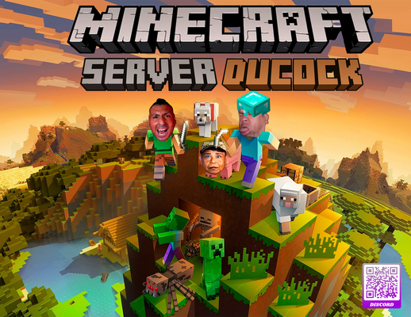

# DUCockAPP



## Descripción

DUCockAPP es una aplicación de escritorio desarrollada en Python que permite descargar y gestionar mods de Minecraft de forma sencilla. La aplicación incluye funcionalidades para descargar mods específicos, instalar NeoForge, y mantener el launcher actualizado.

## Características

- **Interfaz moderna**: Diseño oscuro con tema verde usando CustomTkinter
- **Descarga automática de mods**: Descarga una colección curada de mods de Minecraft
- **Instalación de NeoForge**: Descarga automática del instalador de NeoForge
- **Sistema de actualizaciones**: Verificación automática de nuevas versiones
- **Changelog integrado**: Visualización de los cambios de cada versión

## Requisitos

- Python 3.7 o superior
- Windows (la aplicación está optimizada para Windows)
- Conexión a internet para descargar mods y actualizaciones

## Instalación

1. Clona este repositorio:
```bash
git clone https://github.com/BenjaMorenoo/DUCockAPP.git
cd DUCockAPP
```

2. Instala las dependencias:
```bash
pip install -r requirements.txt
```

3. Ejecuta la aplicación:
```bash
python app.py
```

## Dependencias

- `customtkinter` - Para la interfaz gráfica moderna
- `requests` - Para descargas y actualizaciones
- `Pillow` - Para manejo de imágenes
- `pathlib` - Para manejo de rutas (incluido en Python)

## Uso

### Descargar Mods
1. Haz clic en "Descargar Mods"
2. Los mods se descargarán automáticamente en `%APPDATA%/.minecraft/mods`
3. Se mostrará una confirmación cuando la descarga esté completa

### Descargar NeoForge
1. Haz clic en "Descargar NeoForge"
2. El instalador se descargará en tu carpeta de Descargas
3. Ejecuta el instalador manualmente para completar la instalación

### Buscar Actualizaciones
1. Haz clic en "Buscar Actualizaciones"
2. Si hay una nueva versión disponible, se te preguntará si deseas actualizar
3. La actualización te redirigirá al enlace de descarga

### Ver Cambios
1. Haz clic en "Ver Cambios"
2. Se mostrará el changelog de la versión actual

## Mods Incluidos

La aplicación descarga automáticamente los siguientes mods:

- **Farmer's Delight** - Mejoras en agricultura y cocina
- **Patchouli** - Sistema de documentación en el juego
- **Xaero's World Map & Minimap** - Mapas del mundo y minimapa
- **JEI (Just Enough Items)** - Visor de recetas
- **Iris** - Shaders y optimización gráfica
- **Sodium** - Optimización de rendimiento
- **Geckolib** - Librería de animaciones
- **Cooking for Blockheads** - Sistema de cocina mejorado
- **Useful Backpacks** - Mochilas útiles
- **Refurbished Furniture** - Muebles renovados
- Y muchos más...

## Estructura del Proyecto

```
DUCockAPP/
├── app.py                 # Aplicación principal
├── mods_downloader.py     # Lógica de descarga de mods
├── updater.py            # Sistema de actualizaciones
├── version.json          # Información de versión
├── README.md             # Este archivo
├── assets/
│   ├── background.png    # Imagen de fondo
│   └── ducock.jpg       # Logo del proyecto
└── __pycache__/         # Archivos compilados de Python
```

## Versión Actual

**v1.0.0** - Versión inicial del launcher

## Configuración

El launcher está configurado para:
- Modo oscuro por defecto
- Tema de color verde
- Ventana de tamaño fijo (600x400)
- Descarga automática en directorios estándar de Minecraft

## Contribuciones

Las contribuciones son bienvenidas. Por favor:

1. Haz fork del repositorio
2. Crea una rama para tu feature (`git checkout -b feature/nueva-funcionalidad`)
3. Commit tus cambios (`git commit -am 'Añade nueva funcionalidad'`)
4. Push a la rama (`git push origin feature/nueva-funcionalidad`)
5. Crea un Pull Request

## Licencia

Este proyecto está bajo la Licencia MIT. Consulta el archivo `LICENSE` para más detalles.

## Contacto

- **Desarrollador**: BenjaMorenoo
- **GitHub**: [https://github.com/BenjaMorenoo](https://github.com/BenjaMorenoo)
- **Repositorio**: [https://github.com/BenjaMorenoo/DUCockAPP](https://github.com/BenjaMorenoo/DUCockAPP)

## Créditos

- Desarrollado con CustomTkinter para una interfaz moderna
- Utiliza la API de GitHub para actualizaciones automáticas
- Optimizado para Minecraft con NeoForge

---

⚠️ **Nota**: Este launcher está diseñado específicamente para Windows. Para otros sistemas operativos, es posible que necesites modificar las rutas de descarga en el código.